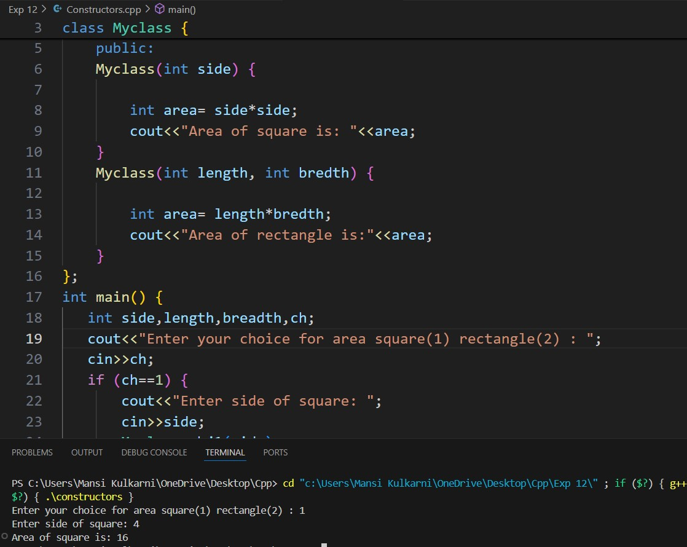
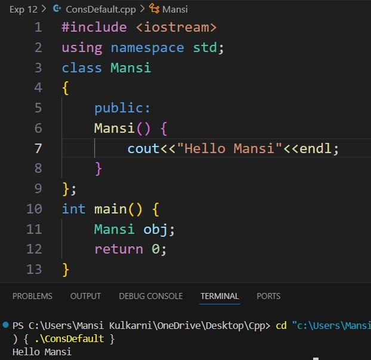
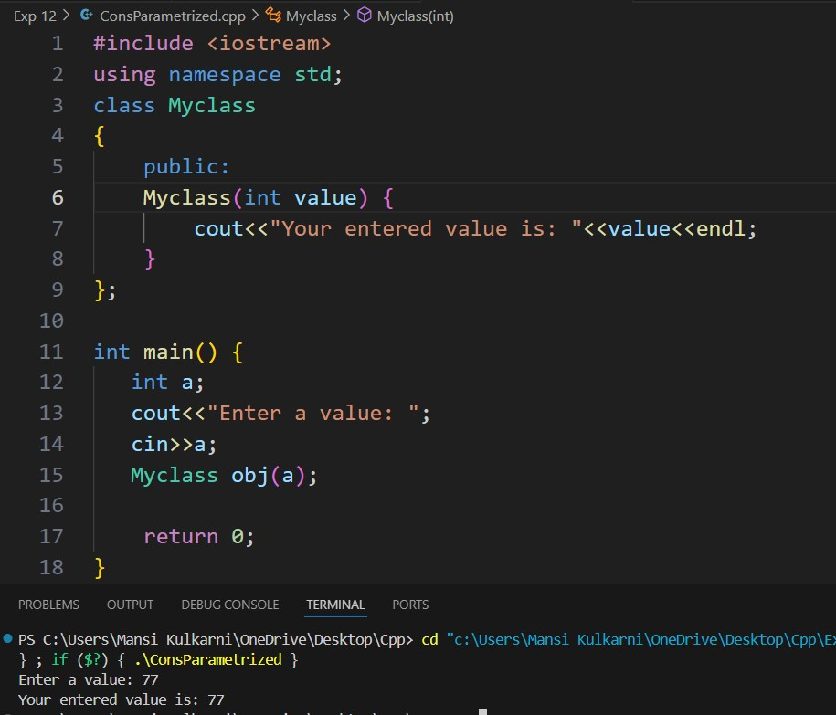
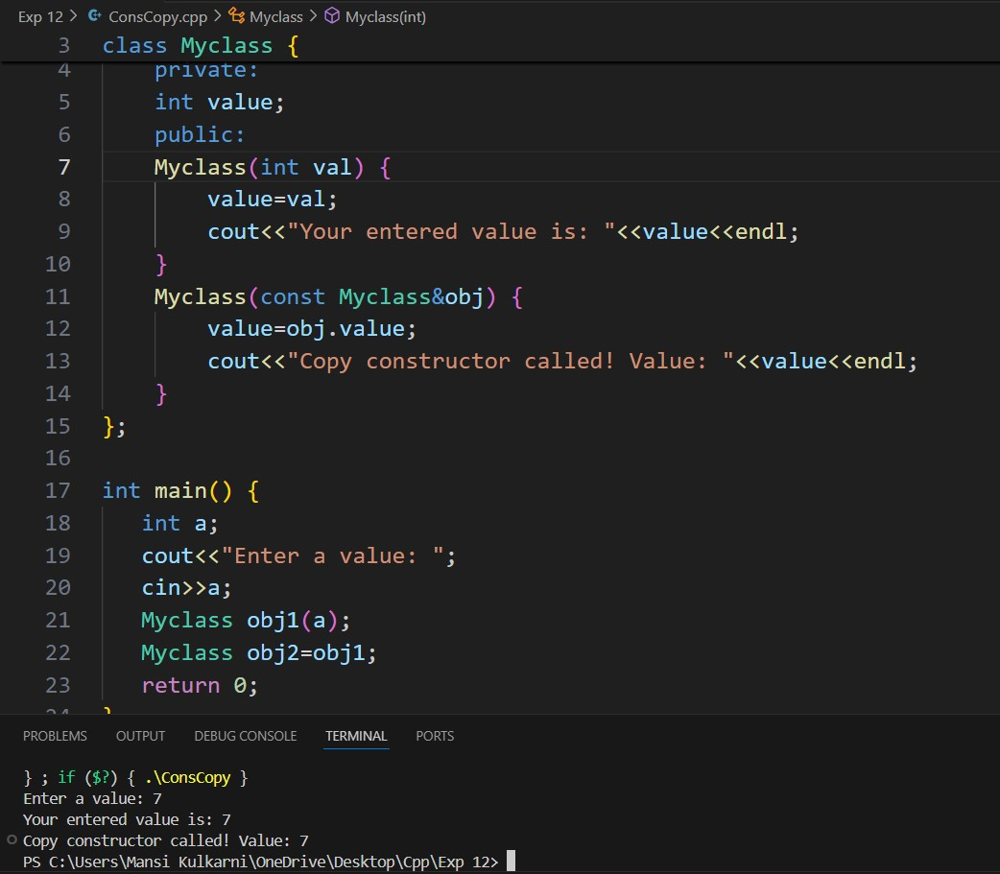
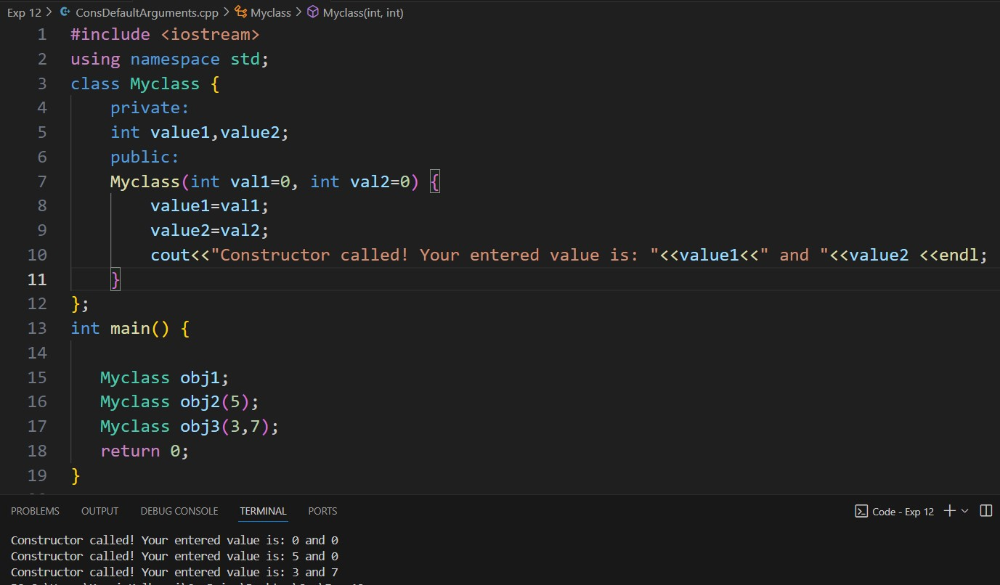
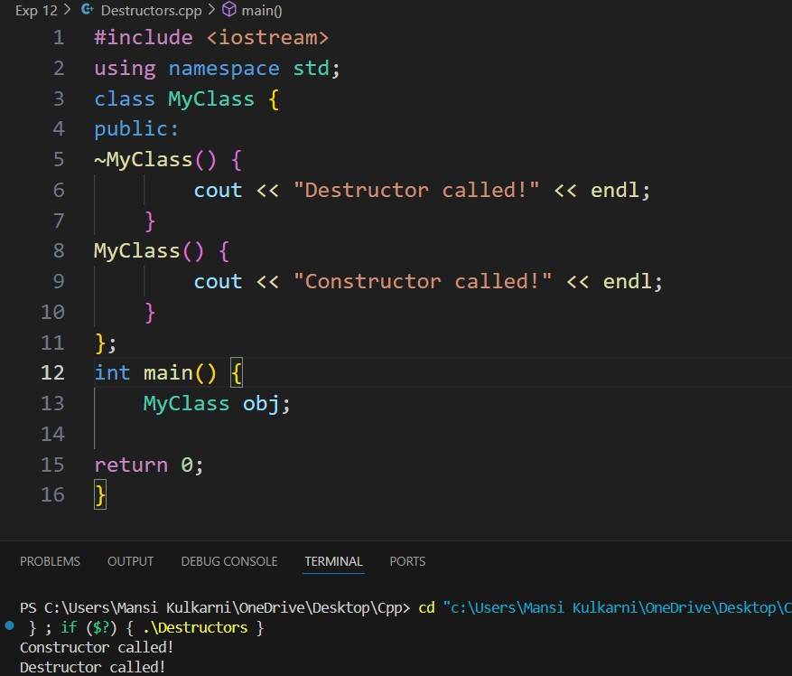

# Experiment 12
The name of the constructor is same as its class name. Constructors are mostly declared in the public section of the class though it can be declared in the private section of the class. Constructors do not return values; hence they do not have a return type. A constructor gets called automatically when we create the object of the class. Constructors are used when variables need to be initiated before object is called.
The prototype of Constructors is as follows: 	<class-name> (list-of-parameters);
Constructors can be defined inside or outside the class declaration. The syntax for defining the constructor within the class: <class-name> (list-of-parameters) { // constructor definition };
The syntax for defining the constructor outside the class: <class-name>: :<class-name> (list-of-parameters){ // constructor definition};

## Program 0
### Aim: 
Study constructors
### Software used: 
Visual Studio Code
### Theory:
A constructor in C++ is a special member function that is automatically called when an object of a class is created. Its primary purpose is to initialize the object's attributes. Constructors share the same name as the class and do not have a return type. They enable controlled object creation and setup of default values or specific logic for the object's initialization.
### Output:

### Conclusion:
We learned constructors in C++

## Program 1
### Aim: 
To implement Default Constructors. 
### Software used: 
Visual Studio Code
### Theory:
A default constructor is a constructor that takes no parameters or has all default arguments. If no constructor is explicitly defined, C++ automatically provides a default constructor. It initializes the class's members with default values (for built-in types) or calls their default constructors (for other objects).
### Output:

### Conclusion:
We learned how to implement default constructors in C++. 

## Program 2
### Aim: 
To implement Parameterized constructos. 
### Software used: 
Visual Studio Code
### Theory:
A parameterized constructor allows arguments to be passed when an object is created. This constructor initializes object attributes with specific values provided by the user. It enables flexibility in object creation by allowing different initialization based on the passed parameters.
### Output:

### Conclusion:
We learned how to implement parameterized constructors in C++. 

## Program 3
### Aim: 
To implement Copy Constructors
### Software used: 
Visual Studio Code
### Theory:
A copy constructor creates a new object as a copy of an existing object. It takes a reference to an object of the same class as its parameter and duplicates the attributes of the given object. The copy constructor is called when an object is passed by value, returned by value, or explicitly copied. It ensures that the new object has the same state as the copied object.
### Output:

### Conclusion:
We learned how to implement copy constructors in C++. 

## Program 4
### Aim: 
To use Constructors with default Arguments. 
### Software used: 
Visual Studio Code
### Theory:
These constructors allow one or more parameters to have default values. When an object is created, if no argument is provided for these parameters, the default values are used. This feature combines the flexibility of parameterized constructors with default behavior.
### Output:

### Conclusion:
We learned how to use constructors with default arguments in C++. 

## Program 5
### Aim: 
To implement destructors. 
### Software used: 
Visual Studio Code
### Theory:
A destructor is a special member function that is automatically called when an object goes out of scope or is explicitly deleted. The destructor has the same name as the class, preceded by a tilde (~), and it has no return type or parameters. Destructors are primarily used to release resources, such as memory or file handles, ensuring that objects clean up after themselves when they are no longer needed.
### Output:

### Conclusion:
We learned how to implement destructors in C++. 
